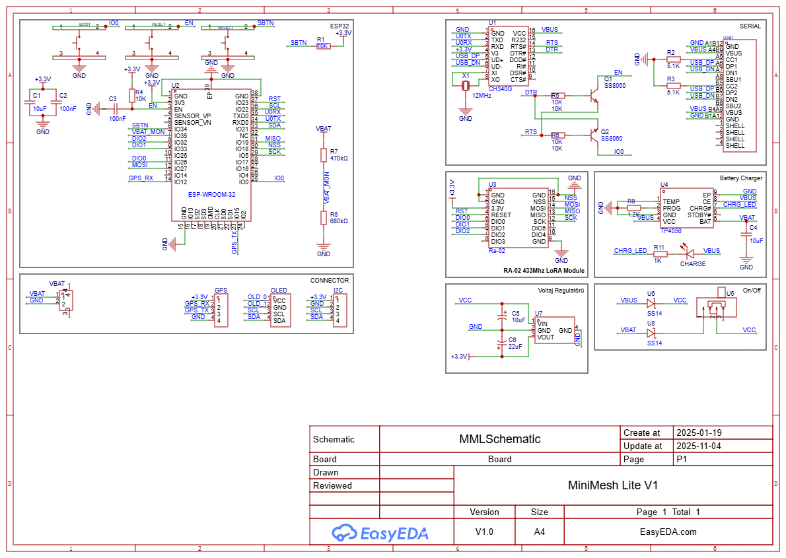

# MiniMesh Lite (ESP32)
A compact and powerful **ESP32 + RA-02 (LoRa)** board designed to support projects such as **Meshtastic**, **LoRaAPRS**, and other LoRa-based communication systems.  
The board includes **one GPS output**, **one I²C port**, and an integrated **1.3” OLED I²C display** for real-time status and telemetry information.

## PCB
### Front & Back Views

---
### Schematic

---
## ⚙️ Features
- **MCU:** ESP32-WROOM-32  
- **LoRa Module:** RA-02 (SX1278 / SX1276)  
- **Display:** 1.3" OLED (I²C, 128x64)  
- **GPS Port:** External GPS module supported (e.g., u-blox, MAX-M10S)  
- **I²C Port:** External sensors or peripherals supported  
- **Power:** 5V USB / Li-ion Battery  
- **Supports Projects:**  
  - [Meshtastic](https://meshtastic.org/)  
  - [LoRaAPRS](https://github.com/richonguzman/LoRa_APRS_Tracker)  
  - Other LoRa-based communication systems
---
### Developer By [Uğur ALTINSOY](https://github.com/uguraltinsoy)
---
### Donate

[OshwLAB ]( https://oshwlab.com/ugur.altnsy/minimesh-lite-v1)

---
### Social

